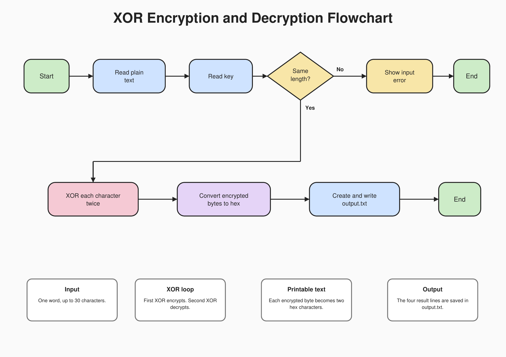

# XOR Encryption and Decryption

## Task Chosen

I chose **Task 1: Encryption and Decryption**.

The program asks for a message and key.

The key must have the same number of letters as the message.

The program uses XOR to encrypt the message and XOR again to decrypt it.

Everything is saved in `output.txt`.

## Flowchart



## How It Works

1. Read the message.
2. Read the key.
3. Check the lengths.
4. XOR each message letter with one key letter.
5. XOR the encrypted byte with the key again.
6. Change the encrypted bytes into printable hexadecimal.
7. Save the results in `output.txt`.

Hexadecimal only uses `0-9` and `A-F`, so the encrypted text is always printable.

## Assembly Code

```asm
; XOR Encryption and Decryption
; Reads a one-word message and a same-length key.
; Saves plain text, key, encrypted text, and decrypted text in output.txt.

section .data
    plain_prompt db 'Enter plain text: '
    plain_prompt_len equ $ - plain_prompt
    key_prompt db 'Enter key: '
    key_prompt_len equ $ - key_prompt

    error_msg db 'Error: message and key must have the same length.', 10
    error_len equ $ - error_msg
    filename db 'output.txt', 0

    plain_label db 'Plain text: '
    plain_label_len equ $ - plain_label
    key_label db 10, 'Key: '
    key_label_len equ $ - key_label
    encrypted_label db 10, 'Encrypted text: '
    encrypted_label_len equ $ - encrypted_label
    decrypted_label db 10, 'Decrypted text: '
    decrypted_label_len equ $ - decrypted_label
    newline db 10

section .bss
    plaintext resb 31
    key resb 31
    encrypted resb 31
    decrypted resb 31
    hex_output resb 62
    message_length resd 1
    hex_length resd 1
    counter resd 1
    fd_out resd 1

section .text
    global _start

_start:
    ; Read the message.
    mov ecx, plain_prompt
    mov edx, plain_prompt_len
    call print_text
    mov ecx, plaintext
    call read_word
    mov [message_length], eax
    cmp eax, 0
    je length_error

    ; Read the key.
    mov ecx, key_prompt
    mov edx, key_prompt_len
    call print_text
    mov ecx, key
    call read_word

    ; Stop if the lengths are different.
    cmp eax, [message_length]
    jne length_error

    ; Encrypt and decrypt one character at a time.
    mov ebx, plaintext
    mov ecx, key
    mov edx, encrypted
    mov ebp, decrypted
    mov eax, [message_length]
    mov [counter], eax

crypt_loop:
    mov al, [ebx]
    xor al, [ecx]
    mov [edx], al

    xor al, [ecx]
    mov [ebp], al

    inc ebx
    inc ecx
    inc edx
    inc ebp
    dec dword [counter]
    jnz crypt_loop

    ; Turn each encrypted byte into two printable hex characters.
    mov edx, encrypted
    mov ecx, hex_output
    mov eax, [message_length]
    mov [counter], eax

hex_loop:
    xor eax, eax
    mov al, [edx]
    mov bl, 16
    div bl

    mov bh, ah
    call hex_digit
    mov [ecx], al
    inc ecx

    mov al, bh
    call hex_digit
    mov [ecx], al
    inc ecx

    inc edx
    dec dword [counter]
    jnz hex_loop

    mov eax, [message_length]
    add eax, eax
    mov [hex_length], eax

    ; Create output.txt.
    mov eax, 8
    mov ebx, filename
    mov ecx, 0711o
    int 0x80
    mov [fd_out], eax

    ; Write all four result lines.
    mov ecx, plain_label
    mov edx, plain_label_len
    call write_file
    mov ecx, plaintext
    mov edx, [message_length]
    call write_file

    mov ecx, key_label
    mov edx, key_label_len
    call write_file
    mov ecx, key
    mov edx, [message_length]
    call write_file

    mov ecx, encrypted_label
    mov edx, encrypted_label_len
    call write_file
    mov ecx, hex_output
    mov edx, [hex_length]
    call write_file

    mov ecx, decrypted_label
    mov edx, decrypted_label_len
    call write_file
    mov ecx, decrypted
    mov edx, [message_length]
    call write_file

    mov ecx, newline
    mov edx, 1
    call write_file

    mov eax, 6
    mov ebx, [fd_out]
    int 0x80

    mov eax, 1
    mov ebx, 0
    int 0x80

; Show a prompt or error on the terminal.
print_text:
    mov eax, 4
    mov ebx, 1
    int 0x80
    ret

; Read one word and return its length without Enter.
read_word:
    mov eax, 3
    mov ebx, 0
    mov edx, 31
    int 0x80
    dec eax
    ret

; Change a number from 0-15 into one ASCII hex character.
hex_digit:
    cmp al, 10
    jl number_digit
    add al, 55
    ret

number_digit:
    add al, 48
    ret

; Write the buffer in ECX to output.txt.
write_file:
    mov eax, 4
    mov ebx, [fd_out]
    int 0x80
    ret

length_error:
    mov ecx, error_msg
    mov edx, error_len
    call print_text

    mov eax, 1
    mov ebx, 1
    int 0x80

```

## Build and Run

```bash
nasm -f elf32 encryption.asm -o encryption.o
ld -m elf_i386 encryption.o -o encryption
./encryption
cat output.txt
```

## Rules

- Use one word.
- The key must have the same length.
- Capital and lowercase letters are different.
- The maximum length is 30 characters.

## Example

```text
Enter plain text: GHOST
Enter key: LICHY
```

`output.txt`:

```text
Plain text: GHOST
Key: LICHY
Encrypted text: 0B010C1B0D
Decrypted text: GHOST
```

## Challenges

The first hard part was checking that both words had the same length.

The second hard part was making the encrypted bytes printable.

The program shows each encrypted byte as two hexadecimal characters.

The last hard part was using XOR two times. The first XOR encrypts the message. The second XOR brings the message back.

## Video Presentation

YouTube submission link:

[Watch the Final Project Presentation](https://youtu.be/XvpZRc180ko?feature=shared)
